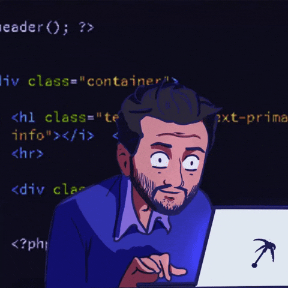

## Hi there 👋
 ###

 

💻 My name is Artur Matias, i'm a **Full-Stack Developer** passionate about technology.

This is the space where i spend most of my time, a place where imagination and creativity become code! :rocket:
 
 
 
 
 
 
 
 
 

### 💻 *Frontend*

  

  

### 🔧 *Backend*

  

### ☁️ *DevOps & Cloud*

  

---

 

---
